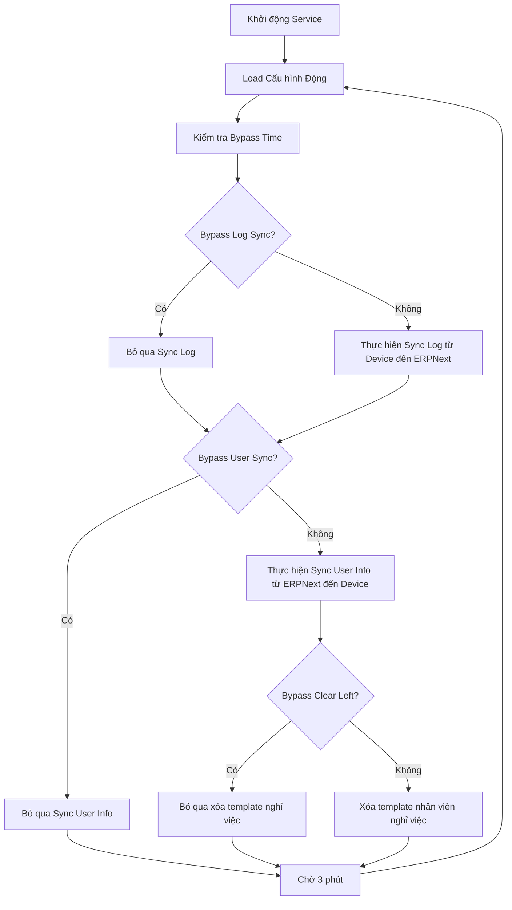

# Hệ Thống Đồng Bộ Chấm Công ERPNext

Hệ thống đồng bộ tự động giữa máy chấm công sinh trắc học và ERPNext với khả năng bypass thời gian và auto-restart.

## 📁 Cấu Trúc Thư Mục

```
biometric-attendance-sync-tool/
├── README.MD                                    # Tài liệu chính (tiếng Việt)
├── README_SERVICE.md                            # Tài liệu dịch vụ (tiếng Anh)
├── local_config.py                              # Cấu hình tĩnh + cấu hình động bypass
├── erpnext_sync_all.py                          # Dịch vụ chính điều phối
├── sync_log_from_device_to_erpnext.py          # Sync log chấm công từ thiết bị đến ERPNext
├── sync_user_info_from_erpnext_to_device.py    # Sync thông tin nhân viên từ ERPNext đến thiết bị
├── sync_user_info_state.py                     # Quản lý trạng thái sync user info
├── erpnext_api_client.py                       # Client API ERPNext
├── test_finger_mapping_consistency.py          # Test script kiểm tra tính nhất quán finger mapping
├── start_erpnext_sync_all_manual.sh            # Script khởi động service thủ công
├── stop_erpnext_sync_all_manual.sh             # Script dừng service thủ công (force kill)
├── status_erpnext_sync_all_manual.sh           # Script kiểm tra trạng thái service
├── test_paths.sh                               # Script test đường dẫn
├── requirements.txt                            # Danh sách dependencies
├── set_up_requirement.sh                       # Script cài đặt dependencies và phân quyền
└── logs/                                       # Thư mục chứa log
    ├── service.log                             # Log dịch vụ chính
    ├── service_error.log                       # Log lỗi dịch vụ
    ├── logs.log                                # Log tổng quát
    ├── error.log                               # Log lỗi
    ├── attendance_success_log_*.log            # Log thành công theo thiết bị
    ├── attendance_failed_log_*.log             # Log thất bại theo thiết bị
    ├── user_id_ignored_log.txt                 # Log user bị bỏ qua
    ├── error_duplicate.log                     # Log lỗi trùng lặp
    └── sync_from_erpnext_to_device/           # Log sync user info
```

## ⚙️ Thuật Toán Hoạt Động

### 🔄 Chu Kỳ Chính (Mỗi 3 phút)



### 🎯 Chi Tiết Các Bước

**1. Sync Log từ Device đến ERPNext**
- Kết nối với từng máy chấm công
- Lấy dữ liệu chấm công mới
- Gửi đến ERPNext API
- Xử lý lỗi và retry
- Ghi log thành công/thất bại

**2. Sync User Info từ ERPNext đến Device**
- Lấy danh sách nhân viên có thay đổi
- **Normalize tên tiếng Việt**: `Nguyễn Văn A` → `Nguyen Van A` (device compatibility)
- Phân loại: Active, Left, Changed
- Sync template vân tay
- Xóa template nhân viên nghỉ việc (nếu không bị bypass)

**3. Time-based Bypass Logic**
- **07:30-07:55**: Bypass tất cả (giờ vào ca sáng)
- **17:00-17:30**: Bypass tất cả (giờ tan ca chiều)  
- **00:00-22:00**: Bypass xóa template nghỉ việc

## 🚀 Cách Cài Đặt và Chạy

### Bước 1: Cài đặt Dependencies và Phân quyền
```bash
# Cài đặt dependencies trong virtual environment và set permissions
./set_up_requirement.sh
```

### Bước 2: Kiểm tra Đường dẫn
```bash
# Kiểm tra tự động detect paths
./test_paths.sh
```

### Bước 3: Khởi động Service Thủ công
```bash
# Khởi động service thủ công (không cần sudo)
./start_erpnext_sync_all_manual.sh
```

### Bước 4: Kiểm tra Service hoạt động
```bash
# Kiểm tra trạng thái service
./status_erpnext_sync_all_manual.sh

# Dừng service (force kill tất cả processes)
./stop_erpnext_sync_all_manual.sh
```

### Bước 5: Theo dõi Logs
```bash
# Xem log realtime
tail -f logs/service.log

# Xem tất cả logs
tail -f logs/*.log
```

## 📊 Cách Kiểm tra Service

### 🔍 Kiểm tra Trạng Thái Service

```bash
# Trạng thái tổng quan với chi tiết đầy đủ
./status_erpnext_sync_all_manual.sh

# Kiểm tra process đang chạy
ps aux | grep 'erpnext_sync_all.py'

# Kiểm tra PID file
cat erpnext_sync_all.pid

# Kiểm tra connectivity đến devices
ping 10.0.1.48
ping 10.0.1.50
```

### 📈 Theo dõi Hoạt động

```bash
# Theo dõi log service real-time
tail -f logs/service.log

# Theo dõi log errors
tail -f logs/error.log

# Theo dõi tất cả logs
tail -f logs/*.log

# Xem logs trong ngày
grep "$(date +%Y-%m-%d)" logs/service.log

# Kiểm tra device connectivity logs
tail -f logs/attendance_success_log_*.log
```

### ⚡ Test Manual

```bash
# Test cấu hình
venv/bin/python3 erpnext_sync_all.py --test-config

# Xem status cấu hình  
venv/bin/python3 erpnext_sync_all.py --status

# Test 15 giây (dừng service trước)
./stop_erpnext_sync_all_manual.sh
timeout 15 venv/bin/python3 erpnext_sync_all.py

# Chạy manual để debug
./stop_erpnext_sync_all_manual.sh
venv/bin/python3 erpnext_sync_all.py
```

## 📋 Cách Xem Log

### 🗂️ Các File Log Chính

1. **Service Log**
   ```bash
   # Log chính của service
   tail -f logs/service.log
   
   # Log lỗi service
   tail -f logs/service_error.log
   ```

2. **Application Log**  
   ```bash
   # Log tổng quát
   tail -f logs/logs.log
   
   # Log lỗi ứng dụng
   tail -f logs/error.log
   ```

3. **Sync Log**
   ```bash
   # Log thành công theo từng máy
   tail -f logs/attendance_success_log_Machine_8.log
   tail -f logs/attendance_success_log_Machine_10.log
   
   # Log thất bại theo từng máy
   tail -f logs/attendance_failed_log_Machine_8.log
   tail -f logs/attendance_failed_log_Machine_10.log
   
   # Log user bị ignore
   tail -f logs/user_id_ignored_log.txt
   
   # Log duplicate timestamp
   tail -f logs/error_duplicate.log
   ```

4. **User Sync Log**
   ```bash
   # Log sync user info
   tail -f logs/sync_from_erpnext_to_device/sync_to_device.log
   ```

## 👆 Finger Mapping Utilities

Hệ thống sử dụng **standardized finger mapping** để đảm bảo tính nhất quán giữa finger index và finger name:

### **Finger Index Mapping:**
```
0: Left Little    5: Right Thumb
1: Left Ring      6: Right Index  
2: Left Middle    7: Right Middle
3: Left Index     8: Right Ring
4: Left Thumb     9: Right Little
```

### **Available Functions:**
- `local_config.get_finger_name(finger_index)` - Chuyển index thành name
- `local_config.get_finger_index(finger_name)` - Chuyển name thành index
- `local_config.validate_finger_index(index)` - Validate finger index
- `local_config.validate_finger_name(name)` - Validate finger name

### **Consistency Testing:**
```bash
# Test tính nhất quán finger mapping toàn bộ codebase
venv/bin/python3 test_finger_mapping_consistency.py
```

**🎯 Tất cả modules đều sử dụng finger mapping từ local_config.py để đảm bảo tính nhất quán!**

## 🔤 Xử Lý Tên Tiếng Việt

Hệ thống **luôn luôn** normalize tên tiếng Việt khi sync từ ERPNext đến device để đảm bảo tương thích:

### **Ví dụ Name Normalization:**
```
Nguyễn Văn A        → Nguyen Van A
Trần Thị Bích Thảo  → Tran Thi Bich Thao  
Lê Hoàng Đức        → Le Hoang Duc
Phạm Quỳnh Như      → Pham Quynh Nhu
```

### **Lý do:**
- ✅ **Device compatibility**: Tránh lỗi hiển thị trên máy chấm công
- ✅ **Character encoding**: Tránh conflict với device firmware
- ✅ **Consistency**: Đồng nhất trên tất cả devices
- ✅ **Reliability**: Giảm thiểu lỗi sync do special characters

### **Implementation:**
- Sử dụng thư viện `unidecode` 
- Tự động fallback nếu không có unidecode
- Apply cho tất cả employee names khi sync đến device

### 🔎 Log Analysis Commands

```bash
# Đếm số lần sync thành công hôm nay
grep "$(date +%Y-%m-%d)" logs/attendance_success_log_*.log | wc -l

# Xem errors trong 24h qua
grep "ERROR" logs/error.log | tail -50

# Kiểm tra cycle frequency
grep "CYCLE #" logs/service.log | tail -10

# Xem bypass status
grep "Cấu Hình Động" logs/service.log | tail -5

# Tìm duplicate errors
grep "DUPLICATE" logs/error_duplicate.log | tail -20

# Performance monitoring  
grep "completed.*in.*s" logs/service.log | tail -10
```

## ⚙️ Cấu Hình Bypass Time

### 📝 Chỉnh sửa Bypass Periods trong `local_config.py`

```python
# Bypass sync log từ device đến ERPNext (giờ rush)
sync_log_by_pass_period = [
    {"start": "07:30", "end": "07:55", "reason": "Morning rush"},
    {"start": "17:00", "end": "17:30", "reason": "Evening rush"}
]

# Bypass sync user info từ ERPNext đến device (giờ rush)  
sync_user_info_by_pass_period = [
    {"start": "07:30", "end": "07:55", "reason": "Morning rush"},
    {"start": "17:00", "end": "17:30", "reason": "Evening rush"}
]

# Bypass xóa template nghỉ việc (chỉ cho phép sau 22:00)
clear_left_user_template_by_pass_period = [
    {"start": "00:00", "end": "22:00", "reason": "Working hours"}
]
```

### 🎛️ Feature Toggles

```python
# Bật/tắt chức năng sync user info
ENABLE_SYNC_USER_INFO_FROM_ERPNEXT_TO_DEVICE = True

# Bật/tắt chức năng xóa template nghỉ việc
ENABLE_CLEAR_LEFT_USER_TEMPLATES = True

# Chế độ sync: 'auto', 'full', 'changed'
SYNC_USER_INFO_MODE = 'auto'

# Safety net: Số giờ quét ngược khi mất last_sync state
SYNC_CHANGED_HOURS_BACK = 24
```

### 📝 Chi tiết SYNC_CHANGED_HOURS_BACK

**Mục đích**: Safety net (lưới an toàn) khi mất file state

**Hoạt động bình thường (99.9% trường hợp):**
- Service sync từ `last_sync` (3 phút trước)
- SYNC_CHANGED_HOURS_BACK **KHÔNG** được sử dụng

**Chỉ sử dụng khi khẩn cấp:**
- 🔥 File state bị mất/corrupt (`logs/sync_from_erpnext_to_device/last_sync_global.json`)
- 🔥 Lần đầu chạy sau khi xóa logs
- 🔥 Service crash nhiều ngày
- 🔥 Manual reset state

**Ví dụ logic:**
```python
# Ưu tiên: Dùng last_sync từ file state (3 phút trước)
since_datetime = self.sync_state.get_last_sync() or \
                # Fallback: Quét ngược 24h thay vì full sync toàn bộ DB
                (datetime.now() - timedelta(hours=24))
```

**Lợi ích**: Tránh full sync toàn bộ database khi có sự cố

## 🛠️ Quản lý Service Manual

### ▶️ Start/Stop/Status

```bash
# Khởi động service (với conflict detection)
./start_erpnext_sync_all_manual.sh

# Dừng service (force kill tất cả processes)
./stop_erpnext_sync_all_manual.sh

# Kiểm tra trạng thái service
./status_erpnext_sync_all_manual.sh

# Khởi động lại (stop + start)
./stop_erpnext_sync_all_manual.sh && ./start_erpnext_sync_all_manual.sh
```

### 🔧 Configuration Management

```bash
# Chỉnh sửa cấu hình
nano local_config.py

# Service sẽ tự động reload config mỗi 3 phút
# Không cần restart - cấu hình động sẽ tự áp dụng

# Hoặc restart để áp dụng ngay
./stop_erpnext_sync_all_manual.sh
./start_erpnext_sync_all_manual.sh
```

### 🔧 Setup và Permissions

```bash
# Setup lại dependencies và permissions
./set_up_requirement.sh

# Manual permissions fix
chmod +x *.sh
chmod +x *.py
chmod 755 logs/
```

## 🚨 Xử Lý Lỗi Thường Gặp

### 1. Service không khởi động được
```bash
# Kiểm tra trạng thái chi tiết
./status_erpnext_sync_all_manual.sh

# Kiểm tra file paths
./test_paths.sh

# Test cấu hình
venv/bin/python3 erpnext_sync_all.py --test-config

# Kiểm tra logs
tail -f logs/error.log
```

### 2. Kết nối device thất bại
```bash
# Kiểm tra IP device trong local_config.py
# Kiểm tra network connectivity
ping 10.0.1.48
ping 10.0.1.50

# Status script tự động test connectivity
./status_erpnext_sync_all_manual.sh

# Xem log kết nối device
grep "Device.*not reachable" logs/service.log
```

### 3. ERPNext API errors
```bash
# Kiểm tra API credentials trong local_config.py  
# Test API connection
curl -X GET "http://10.0.1.21/api/resource/Employee" \
  -H "Authorization: token 7c5bab33922d7f6:2d379dbe1ef33ab"

# Xem API errors
grep "ERPNext API" logs/error.log
```

### 4. Performance Issues
```bash
# Kiểm tra thời gian cycle
grep "completed.*in.*s" logs/service.log | tail -10

# Monitor resource usage
htop -p $(pgrep -f erpnext_sync_all)

# Kiểm tra disk space cho logs
du -h logs/
```

## 📞 Support

- **Kiểm tra trạng thái**: `./status_erpnext_sync_all_manual.sh`
- **Xem log chi tiết**: `tail -f logs/service.log`
- **Test cấu hình**: `venv/bin/python3 erpnext_sync_all.py --test-config`  
- **Debug manual**: `./stop_erpnext_sync_all_manual.sh && venv/bin/python3 erpnext_sync_all.py`
- **Path detection**: `./test_paths.sh`
- **Setup lại**: `./set_up_requirement.sh`

---
