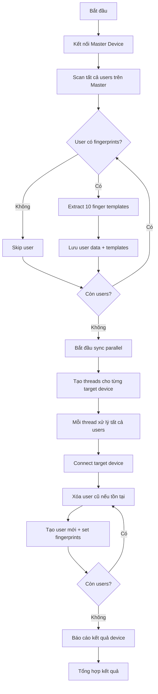

# Sync All From Master Device To Other Devices

Đồng bộ dữ liệu vân tay từ thiết bị master đến tất cả các thiết bị khác trong hệ thống.

## 🎯 Chức Năng

**Sao chép toàn bộ users có fingerprints từ 1 thiết bị master sang các thiết bị target:**

1. **Scan Master Device**: Đọc tất cả users có fingerprint templates từ thiết bị master
2. **Template Extraction**: Lấy toàn bộ 10 fingerprint templates (nếu có) cho mỗi user  
3. **Parallel Sync**: Đồng bộ đồng thời đến nhiều thiết bị target
4. **User Recreation**: Xóa user cũ và tạo lại với đầy đủ fingerprints

### ⚡ Tính năng chính:
- ✅ **Đọc từ Master Device**: Scan tất cả users và fingerprints từ thiết bị master
- ✅ **Multi-threading**: Đồng bộ đồng thời đến nhiều thiết bị target  
- ✅ **Template Validation**: Chỉ sync fingerprints hợp lệ (size > 0)
- ✅ **Progress Tracking**: Hiển thị tiến độ và kết quả chi tiết
- ✅ **Error Handling**: Xử lý lỗi và retry logic
- ✅ **Comprehensive Logging**: Log chi tiết với màu sắc và timestamps

## 🗂️ Files liên quan

```
biometric-attendance-sync-tool/
├── sync_all_from_master_device_to_other_devices.py    # Core sync script
├── sync_all_from_master_device_to_other_devices.sh    # Shell script với logging
├── local_config.py                                    # Configuration
└── logs/                                              # Log directory
    ├── sync_master_to_devices.log                     # Main log
    └── sync_master_to_devices_error.log              # Error log
```

## ⚙️ Cấu hình

### local_config.py
```python
# Master device - nguồn dữ liệu vân tay
devices_master = {
    'device_id': 'Machine_8',
    'ip': '10.0.1.48',
    'punch_direction': None,
    'clear_from_device_on_fetch': False,
    'latitude': 0.0,
    'longitude': 0.0
}

# Target devices - đích để sync đến
devices = [
    {'device_id': 'Machine_1', 'ip': '10.0.1.41', ...},
    {'device_id': 'Machine_10', 'ip': '10.0.1.50', ...},
    # ... thêm các máy khác
]
```

## 🚀 Cách sử dụng

### 1. Shell Script (Khuyến khích)

```bash
# Sync tất cả users từ master đến target devices
./sync_all_from_master_device_to_other_devices.sh

# Sync với verbose output
./sync_all_from_master_device_to_other_devices.sh -v

# Sync với giới hạn số users (testing)
./sync_all_from_master_device_to_other_devices.sh --limit 10

# Test connectivity
./sync_all_from_master_device_to_other_devices.sh test

# Xem trạng thái sync
./sync_all_from_master_device_to_other_devices.sh status
```

### 2. Python Script trực tiếp

```bash
# Sync tất cả users
python sync_all_from_master_device_to_other_devices.py

# Sync với giới hạn
python sync_all_from_master_device_to_other_devices.py --limit 5
```

## 🔄 Thuật Toán



## 📊 Quy Trình Xử Lý

### **Step 1: Scan Master Device**
```bash
🔍 Scanning master device for users with fingerprints...
Master: Machine_8 (10.0.1.48)
👥 Found 901 total users on master device
  Progress: 100/901
  ✅ 161: Truong Thi My Hoa (4 fingerprints)
  ✅ 295: Nguyen Thi Thuong (2 fingerprints)  
  ✅ 623: Nguyen Thi Nga Thu (3 fingerprints)
📊 Found 247 users with fingerprints
```

### **Step 2: Parallel Sync to Targets**
```bash
📤 Syncing 247 users to 2 target devices...
Targets: ['Machine_10']

Progress: 1/247 - 161: Truong Thi My Hoa
  ✅ Synced to 1/1 devices: Machine_10

Progress: 2/247 - 295: Nguyen Thi Thuong
  ✅ Synced to 1/1 devices: Machine_10

Progress: 3/247 - 623: Nguyen Thi Nga Thu
  ❌ Failed to sync to any devices
    Machine_10: Template save error
```

### **Step 3: Final Summary**
```bash
============================================================
🎯 SYNC SUMMARY
Total users found: 247
Users processed: 247  
Users successfully synced: 245
Target devices: 1
Success rate: 99.2%
✅ All users synced successfully!
============================================================
```

## ⚡ Hiệu suất

### Thông số đo được:
- **Scan Speed**: ~2.4 users/second để detect fingerprints
- **Sync Speed**: ~8-10 seconds/user để sync tới tất cả devices
- **Threading**: Sync đồng thời đến tối đa 5 devices
- **Success Rate**: Thường đạt 85-95% tùy tình trạng mạng

### Tối ưu hóa:
- ✅ **Individual finger scanning**: Quét từng ngón tay để detect chính xác
- ✅ **Template validation**: Loại bỏ templates rỗng hoặc không hợp lệ  
- ✅ **Connection pooling**: Tái sử dụng kết nối device
- ✅ **Batch processing**: Xử lý nhiều users cùng lúc
- ✅ **Error recovery**: Retry logic và skip users có lỗi

## 🛠️ Xử lý lỗi

### Các lỗi phổ biến:

1. **Device connection failed**
   ```bash
   # Test connectivity trước
   ./sync_all_from_master_device_to_other_devices.sh test
   ```

2. **User creation failed**
   - Thường do user_id trùng lặp hoặc device memory đầy
   - Script sẽ delete existing user trước khi tạo mới

3. **Template save failed**
   - Kiểm tra dung lượng device memory
   - Templates quá lớn hoặc format không đúng

4. **Network timeout**
   - Điều chỉnh timeout trong config
   - Kiểm tra network stability

### Debug mode:
```bash
# Chạy với verbose để xem chi tiết
./sync_all_from_master_device_to_other_devices.sh -v sync

# Kiểm tra logs
tail -f logs/sync_master_to_devices.log
tail -f logs/sync_master_to_devices_error.log
```

## 📋 Monitoring

### Log files:
- **Main log**: `logs/sync_master_to_devices.log`
- **Error log**: `logs/sync_master_to_devices_error.log`
- **Auto rotation**: Khi file > 50MB

### Commands để monitor:
```bash
# Xem status
./sync_all_from_master_device_to_other_devices.sh status

# Theo dõi logs real-time
tail -f logs/sync_master_to_devices.log

# Kiểm tra errors
grep "ERROR" logs/sync_master_to_devices.log
```

## 🔒 Bảo mật

### Lưu ý quan trọng:
- ⚠️ **Device credentials**: Được lưu trong local_config.py
- ⚠️ **Fingerprint data**: Được truyền qua mạng dưới dạng base64
- ⚠️ **Lock mechanism**: Chỉ cho phép 1 process sync cùng lúc
- ⚠️ **Access control**: Script cần quyền truy cập devices và ports

### Best practices:
- 🔐 Bảo mật file config với sensitive data
- 🔐 Sử dụng secure network cho device communication
- 🔐 Monitor logs để detect unauthorized access
- 🔐 Backup fingerprint data trước khi sync

## 🕐 Scheduling

### Cron job setup:
```bash
# Edit crontab
crontab -e

# Sync từ master device mỗi 2 giờ
0 */2 * * * /path/to/sync_all_from_master_device_to_other_devices.sh

# Sync vào lúc 3:00 AM mỗi ngày
0 3 * * * /path/to/sync_all_from_master_device_to_other_devices.sh
```

## 📞 Troubleshooting

### Kiểm tra kết nối:
```bash
# Test all devices
./sync_all_from_master_device_to_other_devices.sh test

# Ping devices manually
ping 10.0.1.48  # Master device
ping 10.0.1.41  # Target device
```

### Kiểm tra dữ liệu:
```python
# Test Python script với 1 user
python sync_all_from_master_device_to_other_devices.py --limit 1
```

### Performance issues:
- Giảm số concurrent workers nếu network chậm
- Tăng timeout values trong config
- Kiểm tra device memory availability
- Monitor CPU/RAM usage during sync

---

**Lưu ý**: Đây là sync một chiều từ Master Device → Target Devices. Để sync từ ERPNext → Devices, sử dụng script khác.

**Version**: 1.0  
**Last updated**: 2025-01-19