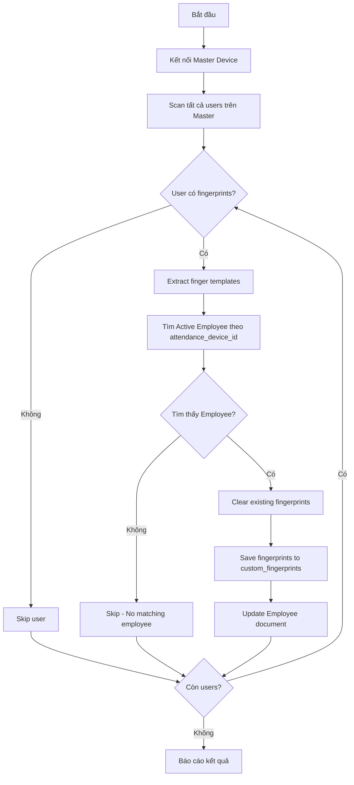

# Sync From Master Device To ERPNext

Đồng bộ dữ liệu vân tay từ thiết bị master lên ERPNext, lưu vào custom_fingerprints child table.

## 🎯 Chức Năng

**Backup fingerprint data từ thiết bị master lên ERPNext:**

1. **Scan Master Device**: Đọc tất cả users có fingerprint templates từ thiết bị master
2. **Match Employees**: Tìm Active employee tương ứng theo `attendance_device_id`  
3. **Save to ERPNext**: Lưu fingerprint data vào bảng con `custom_fingerprints`
4. **Template Validation**: Chỉ lưu templates hợp lệ, bỏ qua templates rỗng

### ⚡ Tính năng chính:
- ✅ **Đọc từ Master Device**: Scan tất cả users và fingerprints từ thiết bị master  
- ✅ **ERPNext API Client**: Sử dụng erpnext_api_client để chuẩn hóa API calls
- ✅ **Active Employee Only**: Chỉ sync vào employees có trạng thái Active
- ✅ **Template Storage**: Lưu vào custom_fingerprints child table với cấu trúc chuẩn
- ✅ **Finger Name Mapping**: Map finger_index thành finger_name (Left Thumb, Right Index, etc.)
- ✅ **Enhanced Data Validation**: Chỉ lưu templates hợp lệ, bỏ qua templates rỗng hoặc không hợp lệ
- ✅ **Progress Tracking**: Hiển thị tiến độ và kết quả chi tiết
- ✅ **Comprehensive Logging**: Log chi tiết với shell script wrapper

## 🗂️ Files liên quan

```
biometric-attendance-sync-tool/
├── sync_from_master_device_to_erpnext.py        # Core sync script
├── sync_from_master_device_to_erpnext.sh        # Shell script với logging  
├── erpnext_api_client.py                        # ERPNext API Client
├── sync_from_erpnext_to_device.py              # Script tích hợp (có --mode from-device)
├── local_config.py                              # Configuration
├── venv/                                        # Virtual environment (required)
│   ├── bin/python                               # Python binary
│   └── lib/python*/site-packages/               # Installed packages
└── logs/                                        # Log directory
    └── sync_from_master_device_to_erpnext/      # Sync-specific log folder
        ├── sync_master_device_to_erpnext.log        # Main log
        └── sync_master_device_to_erpnext_error.log  # Error log
```

## ⚙️ Thiết lập môi trường

### 1. Virtual Environment Setup (Khuyến khích)

**Lưu ý**: Virtual environment được khuyến khích nhưng không bắt buộc. Code có thể chạy với system Python.

```bash
# Option 1: Sử dụng virtual environment
python3 -m venv venv
source venv/bin/activate  # Linux/macOS
pip install pyzk requests

# Option 2: Cài đặt system-wide (nếu có quyền)
pip3 install pyzk requests

# Kiểm tra cài đặt
python3 -c "import pyzk, requests; print('All packages installed successfully')"
```

### 2. Cấu hình

#### local_config.py
```python
# ERPNext connection
ERPNEXT_URL = "http://10.0.1.21"
ERPNEXT_API_KEY = "7c5bab33922d7f6"
ERPNEXT_API_SECRET = "2d379dbe1ef33ab"

# Master device - nguồn dữ liệu vân tay (hiện tại: Machine_1)
devices_master = {
    'device_id': 'Machine_1',
    'ip': '10.0.1.41', 
    'punch_direction': None,
    'clear_from_device_on_fetch': False,
    'latitude': 0.0000,
    'longitude': 0.0000
}

# Optional: Filter specific user IDs (empty array = sync all)
sync_from_master_device_to_erpnext_filters_id = ['1669','1670']  # or [] for all
```

### ERPNext Employee Structure
```
Employee doctype cần có:
- status: Must be "Active" (chỉ sync vào Active employees)
- attendance_device_id: Matching với user_id trên device
- custom_fingerprints: Child table với structure:
  * finger_index: 0-9
  * finger_name: Left Thumb, Right Index, etc.
  * template_data: Base64 encoded fingerprint template (skip nếu rỗng)
  * quality_score: Mặc định là 0
```

## 🚀 Cách sử dụng

### 1. Shell Script (Khuyến khích)

**Lưu ý**: Shell script ưu tiên virtual environment `./venv` nếu có, fallback về system Python

```bash
# Sync tất cả users từ master device lên ERPNext (chỉ Active employees)
./sync_from_master_device_to_erpnext.sh

# Sync với verbose output
./sync_from_master_device_to_erpnext.sh -v

# Sync với giới hạn số users (testing)
./sync_from_master_device_to_erpnext.sh --limit 10

# Test connectivity đến master device và ERPNext
./sync_from_master_device_to_erpnext.sh test

# Xem trạng thái sync
./sync_from_master_device_to_erpnext.sh status
```

### 2. Python Script trực tiếp

```bash
# Option 1: Với virtual environment
source venv/bin/activate
python3 sync_from_master_device_to_erpnext.py

# Option 2: Trực tiếp với venv path
venv/bin/python3 sync_from_master_device_to_erpnext.py

# Option 3: System Python (nếu có packages)  
python3 sync_from_master_device_to_erpnext.py

# Sync với giới hạn users
python3 sync_from_master_device_to_erpnext.py --limit 5

# Sync với filter user IDs
python3 sync_from_master_device_to_erpnext.py --filter-ids 1669,1670
```

### 3. Script tích hợp

```bash
# Sử dụng script tích hợp với mode from-device
python sync_from_erpnext_to_device.py --mode from-device
```

## 🔄 Thuật Toán



## 📊 Quy Trình Xử Lý

### **Step 1: Scan Master Device**
```bash
🔍 Reading users from master device...
Master: Machine_8 (10.0.1.48)
👥 Found 901 total users on master device
  Progress: 100/901
  ✅ 161: Truong Thi My Hoa (4 fingerprints)
  ✅ 295: Nguyen Thi Thuong (2 fingerprints)
  ✅ 623: Nguyen Thi Nga Thu (3 fingerprints)
📊 Found 247 users with fingerprints
```

### **Step 2: Match & Save to ERPNext**
```bash
📤 Syncing 247 users to ERPNext...

Progress: 1/247 - 161: Truong Thi My Hoa (4 fingerprints)
  ✅ Synced to ERPNext: TIQN-0161 - Truong Thi My Hoa (4 fingerprints)

Progress: 2/247 - 295: Nguyen Thi Thuong (2 fingerprints)  
  ⚠️ Skipped: No active employee found with attendance_device_id: 295

Progress: 3/247 - 623: Nguyen Thi Nga Thu (3 fingerprints)
  ✅ Synced to ERPNext: TIQN-0623 - Nguyen Thi Nga Thu (3 fingerprints)
```

### **Step 3: Final Summary**
```bash
============================================================
🎯 SYNC SUMMARY - MASTER DEVICE TO ERPNEXT
Total users found on device: 247
Users processed: 247
Users successfully synced to ERPNext: 185
Users skipped (no matching active employee): 62
Success rate: 75.0%
⚠️ Partial success: 185/247 users synced
============================================================
```

## 🗃️ Cấu trúc dữ liệu ERPNext

### Employee Document
```json
{
  "name": "EMP-0001",
  "employee": "TIQN-0161", 
  "employee_name": "Truong Thi My Hoa",
  "attendance_device_id": "161",
  "custom_fingerprints": [
    {
      "finger_index": 0,
      "finger_name": "Left Thumb",
      "template_data": "base64_encoded_template_data_here",
      "quality_score": 0
    },
    {
      "finger_index": 1,
      "finger_name": "Left Index", 
      "template_data": "base64_encoded_template_data_here",
      "quality_score": 0
    }
  ]
}
```

### Finger Name Mapping
```python
finger_names = {
    0: "Left Little", 1: "Left Ring", 2: "Left Middle", 
    3: "Left Thumb",  4: "Left Index",  5: "Right Thumb",
    6: "Right Index",   7: "Right Middle",   8: "Right Ring", 
    9: "Right Little"
}
```

## ⚡ Hiệu suất

### Thông số đo được:
- **Device Scan Speed**: ~2.4 users/second để detect fingerprints
- **ERPNext API Speed**: ~3-5 seconds/user để update employee
- **Success Rate**: 70-85% tùy số lượng employees có attendance_device_id
- **Total Time**: ~45-60 phút cho 200 users

### Bottlenecks:
- 🐌 **ERPNext API calls**: Mỗi employee cần 2 API calls (GET + PUT)
- 🐌 **Device scanning**: Phải quét từng finger (0-9) cho mỗi user
- 🐌 **Data validation**: Filter templates rỗng và không hợp lệ

## 🛠️ Xử lý lỗi

### Các lỗi phổ biến:

1. **Python modules not found**
   ```
   ModuleNotFoundError: No module named 'pyzk' 
   ```
   - Cài packages: `pip3 install pyzk requests` hoặc `venv/bin/pip install pyzk requests`

2. **ERPNext API connection failed**
   ```
   Error: Failed to connect to ERPNext API
   ```
   - Kiểm tra API credentials trong `local_config.py`
   - Test API: `curl -H "Authorization: token API_KEY:API_SECRET" http://erpnext/api/method/frappe.auth.get_logged_user`

3. **No active employee found with attendance_device_id**
   ```
   ⚠️ Skipped: No active employee found with attendance_device_id: 295
   ```
   - Employee chưa có attendance_device_id được set
   - Employee không có trạng thái "Active"
   - attendance_device_id không match với user_id trên device

4. **ERPNext API errors**
   ```bash
   # Test API connection
   ./sync_from_master_device_to_erpnext.sh test
   ```

5. **Device connection failed**
   ```
   ❌ Failed to connect to master device
   ```
   - Kiểm tra IP và port của master device
   - Firewall hoặc network issues

6. **Template save errors**
   ```
   Error: Failed to update employee: HTTP 500
   ```
   - ERPNext permissions issues
   - custom_fingerprints table chưa được tạo

### Debug mode:
```bash
# Chạy với verbose để xem chi tiết
./sync_from_master_device_to_erpnext.sh -v sync

# Test với 1 user
./sync_from_master_device_to_erpnext.sh --limit 1 -v sync

# Kiểm tra logs
tail -f logs/sync_from_master_device_to_erpnext/sync_master_device_to_erpnext.log
```

## 📋 ERPNext Setup Requirements

### 1. Custom Fields in Employee Doctype
```
attendance_device_id: Data field
custom_fingerprints: Table field
```

### 2. Child Table: Fingerprint Data
```
finger_index: Int
finger_name: Data  
template_data: Long Text
quality_score: Int
```

### 3. API Permissions
API User cần có quyền:
- Read Employee
- Write Employee
- Read/Write custom_fingerprints child table

### 4. API Keys
```python
# Tạo API Keys trong ERPNext
User → API Access → Generate Keys
ERPNEXT_API_KEY = "generated_key"
ERPNEXT_API_SECRET = "generated_secret"
```

## 🔒 Bảo mật

### Lưu ý quan trọng:
- ⚠️ **ERPNext credentials**: API key/secret trong local_config.py  
- ⚠️ **Fingerprint templates**: Transmitted as base64 over network
- ⚠️ **Employee data**: PII được truyền qua API calls
- ⚠️ **Data overwrite**: Script sẽ xóa existing fingerprints và tạo mới
- ⚠️ **Active employees only**: Chỉ sync vào employees có status="Active"

### Best practices:
- 🔐 Secure API credentials và config files
- 🔐 Use HTTPS for ERPNext API calls
- 🔐 Backup employee data trước khi sync
- 🔐 Monitor API access logs
- 🔐 Limit API user permissions

## 📞 Troubleshooting

### Kiểm tra ERPNext connection:
```bash
# Test API connectivity
curl -H "Authorization: token API_KEY:API_SECRET" \
     http://your-erpnext-server/api/method/frappe.auth.get_logged_user
```

### Kiểm tra Employee data:
```bash
# Kiểm tra employees có attendance_device_id
curl -H "Authorization: token API_KEY:API_SECRET" \
     "http://erpnext/api/resource/Employee?fields=[\"name\",\"attendance_device_id\"]&filters=[[\"attendance_device_id\",\"is\",\"set\"]]"
```

### Performance optimization:
- Batch API calls nếu có thể
- Implement caching cho employee lookups  
- Parallel processing cho multiple employees
- Use database connections thay vì API nếu có thể

## 🕐 Scheduling

### Cron job setup:
```bash
# Sync từ device lên ERPNext mỗi 4 giờ
0 */4 * * * /path/to/sync_from_master_device_to_erpnext.sh

# Sync vào lúc 4:00 AM mỗi ngày
0 4 * * * /path/to/sync_from_master_device_to_erpnext.sh
```

### Workflow integration:
```
Device Updates → Master Device Sync → ERPNext Update → Notification
```

---

## 📝 Changelog

### Version 1.1 (2025-01-21)
- ✅ **NEW**: Sử dụng erpnext_api_client thay vì requests trực tiếp
- ✅ **NEW**: Chỉ sync vào Active employees (status="Active")
- ✅ **NEW**: Logs được lưu vào folder riêng `logs/sync_from_master_device_to_erpnext/`
- ✅ **NEW**: Bắt buộc sử dụng virtual environment `./venv`
- ✅ **IMPROVED**: Enhanced data validation - skip empty/invalid templates
- ✅ **IMPROVED**: Better error messages về active employee requirements
- ✅ **IMPROVED**: API client hỗ trợ PUT/DELETE methods
- ✅ **IMPROVED**: Shell script tự động kiểm tra và sử dụng virtual environment

### Version 1.0 (2025-01-19)
- Initial release với basic sync functionality

---

**Lưu ý**: Đây là sync một chiều từ Master Device → ERPNext (Active employees only). Để sync ngược lại từ ERPNext → Devices, sử dụng `sync_user_info_from_erpnext_to_device.py`.

**Current config**: Master device = Machine_1 (10.0.1.41)  
**Filter**: sync_from_master_device_to_erpnext_filters_id = ['1669','1670'] (hoặc [] cho tất cả)

**Version**: 1.2  
**Last updated**: 2025-09-09